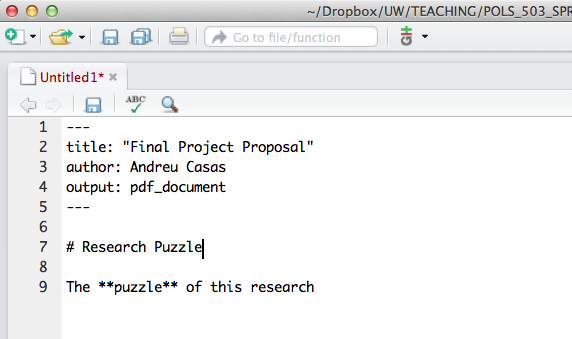
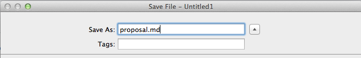

--
title: Resources for Using R Markdown and Markdown
---

# R markdown

The best (and relatively) complete place to get help on R markdown is the
RStudio R Markdown site.

- [R Markdown](http://rmarkdown.rstudio.com/)
- [R Markdown Cheatsheet](http://www.rstudio.com/wp-content/uploads/2015/02/rmarkdown-cheatsheet.pdf)
- [R Markdown Refernence Guide](http://www.rstudio.com/wp-content/uploads/2015/03/rmarkdown-reference.pdf)

Additionally, there are **many** resources for markdown on the internet, but here are a few good interactive tutorials:

- [Markdown Tutorial](http://www.markdowntutorial.com/)
- Another interactive markdown tutorial [http://commonmark.org/help/tutorial/]

*Advanced*: The R markdown in RStudio uses the **rmarkdown** and **knitr** packages and
pandoc.  [Knitr](http://www.rstudio.com/wp-content/uploads/2015/03/rmarkdown-reference.pdf) is a more flexible tool for embedding R (and other) language code chunks
in formatting languages. Markdown is one example, but knitr also allows for code chunks
in LaTeX, HTML, and others. [Pandoc](http://pandoc.org/) is a powerful tool for converting between document
formats, e.g. Markdown to HTML, Markdown to LaTeX, HTML to docx, and many more.

# Markdown

You can also create a simple markdown document (`.md`) using R-Studio. The difference between R-markdown and plain markdown documents is that in R-markdown you can include chuncks of R code and the machine runs them when compiling the document. However, if you have no interest in running code, you can simply write a plain markdown document. To create a markdown using R-Studio, follow these steps:

1. Open a new Text File in R-Studio: `File > New File > Text File`.

2. Write something using` Markdown` syntax. For example:

3. Save the document and end the file name with `.md`: e.g. `proposal.md`.

Now you have a plain Markdown file you can edit in R-Studio
