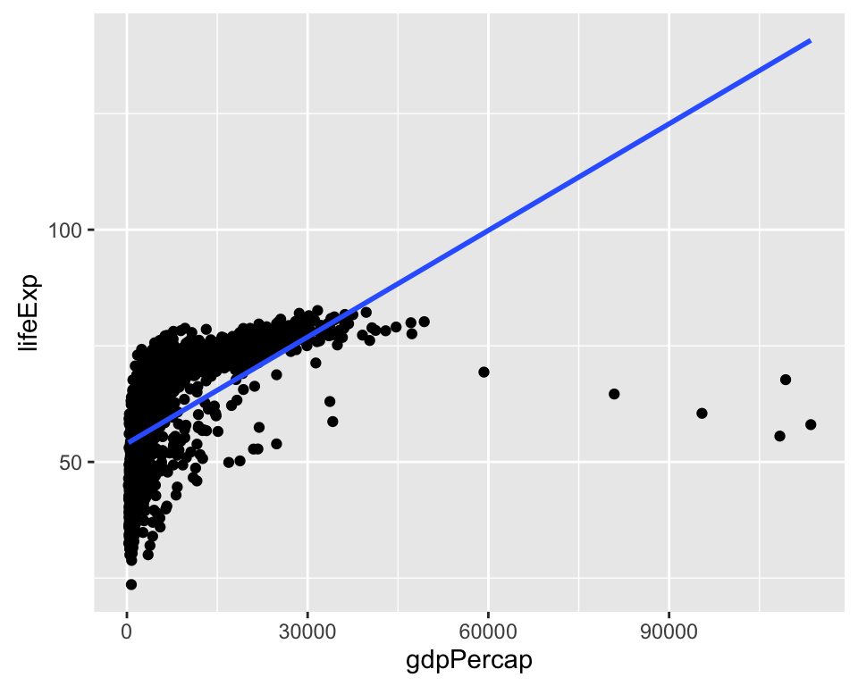

## Learning Objectives

- Learning about multiple ways of transforming your covariates and specifing your models.

## Required Packages and Datasets


```r
library(dplyr)
library(uwpols501)
data(turnout)
```


## Intro
I use as a source of inspiration in this lesson Chris Adolph's POLS-503 [notes](http://faculty.washington.edu/cadolph/503/topic5.pw.pdf). 

<div id="challenge-1" class="panel panel-primary"><div class="panel-heading"><h3 class="panel-title">Challenge</h3></div><div class="panel-body">
How do the model covariates affect the reponse variable in a linear model? What do we mean by "linear" regression?

$y = \beta_{0} + \beta_{1}X_{1} + ... + \epsilon$
</div></div>

In a linear model, any unit change of a given covariate has always the same effect on the outcome variable. If the coefficient for that covariate is for example 0.54, it doesn't matter if the unit change is from 1 to 2 or from 100,001 to 100,002. The expected effect on the outcome variable is always the same: 0.54 increase in the units of the dependent variable. 

However, theoretically we may sometimes think that the way a covariate affects the response variable is not linear.

<div id="challenge-2" class="panel panel-primary"><div class="panel-heading"><h3 class="panel-title">Challenge</h3></div><div class="panel-body">
Look at the following covariates and response variables. Do you think their relationship is linear? If not, describe the type of relationship you think makes the most sense from a theoretical perspective (e.g. exponential, logarithmic, U-shape, etc.).

  - Income Inequality --> Transition to Democracy
  - Education --> Income
  - Age --> Income
</div></div>

## Logrithmic Transformations

Load the `turnout` dataset from the `uw-pols501` package. 
Imagine that `income` is simply a linear function of `age` and education (`educate`).

$income = \beta_{0} + \beta_{1}age + \beta_{2}education + \epsilon$ 

Plot the outcome variable `age` against the response variable `income`.


```r
ggplot(turnout, aes(y = income, x = age)) +
  geom_point() +
  geom_smooth()
```


```r
ggplot(turnout, aes(y = income, x = educate)) +
  geom_point() +
  geom_smooth()
```



