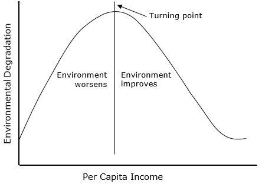

## Learning Objectives

- Learning about multiple ways of transforming your covariates and specifing your models.

## Required Packages and Datasets

Install the packages if you still don't have them (e.g. `install.packages(gapminder)`). If you don't have the `uwpols501` package, you need to install it from GitHub. Install & load the `devtools` package first, and then execute `install_github("UW-POLS501/r-uwpols501")`.
```{r, message = FALSE}
library(dplyr)
library(uwpols501)
library(gapminder)
library(broom)
library(ggplot2)
data(gapminder)
data(turnout)
```

Also go to the following link to download a WDI dataset from 1980 to 2010.

`https://www.dropbox.com/s/qqb3vg66hxqfqzb/wdi_co2_gdp_1980_2010.csv?dl=0`

Load the `wdi` dataset.
```{r}
wdi <- read.csv("data/wdi_co2_gdp_1980_2010.csv")
```


## Intro
I use as a source of inspiration in this lesson Chris Adolph's POLS-503 [notes](http://faculty.washington.edu/cadolph/503/topic5.pw.pdf). 

In a linear model, any unit change of a given covariate has always the same effect on the outcome variable. If the coefficient for that covariate is for example 0.54, it doesn't matter if the unit change is from 1 to 2 or from 100,001 to 100,002. The expected effect on the outcome variable is always the same: 0.54 increase in the units of the dependent variable. 

However, theoretically we may sometimes think that the way a covariate affects the response variable is not linear. For example, is the relationship between `income` and `life expectancy` linear? Or Acemoglu and Robinson (2006) argue that the relationship between `inequality` and `democratization` follows a U-shape. How do we deal with this non-linear relationships? Can we still use a linear models to estimate them?

$y = \beta_{0} + \beta_{1}X_{1} + \beta_{2}X_{2}... + \epsilon$

## Logrithmic Transformations

Think a little bit more about the relationship between Life Expectancy and GDP per capita. This relation is probably not linear. As the GDP per capita of a country increases, on average its citizens have more resources, better nutrition, etc., so you would expect the Life Expectancy of that country to increase. However, at least with the technology and medicines that are currently available, at a certain point Life Expectancy cannot keep increasing at the same rate or it cannot increase at all. 

Load the `gapminder` dataset from the `gapminder` package. 
Estimate a model that portrays `lifeExp` as a linear function of `gdpPercap`.

$lifeExp = \beta_{0} + \beta_{1}gdpPercap + \epsilon$ 

```{r}
mod1a <- lm(lifeExp ~ gdpPercap, data = gapminder)
```

Plot the `lifeExp` that we would predict using this model against the covariate `gdpPercap`. 

```{r, fig.align='center'}
mod1a_augm <- augment(mod1a, gapminder)
ggplot(mod1a_augm, aes(x = gdpPercap, y = .fitted)) +
  geom_point()
```

Uau! This model predicts that the Life Expectancy in Kuwait is 140 years!

Plot now the outcome variable `lifeExp` against the response variable `gdpPercap`.

```{r, fig.align='center'}
ggplot(gapminder, aes(y = lifeExp, x = gdpPercap)) +
  geom_point() 
```

This graphs clearly shows that in the beginning, a unit increase on `gdpPercap` matters a lot in explaining `lifeExp`. However, at some point, extra units increase do not make much of a difference. We call this type of relation a *Logarithmic Relation*. How can we specify this logarithmic relation in a linear model? 

If we believe that there is a *logarithmic* relation between the outcome variable and a covariate, this is the same as saying that there is a *linear* relation between the outcome variable and the $log$ of the covariate. Thus, we just need to transform the covariate of interest by calculating its $log$ and then add the resulting variable to the linear model.

To show this, include a new variable to the `gapminder` dataset: the *log* of `gdpPercap`.
```{r}
gapminder <- mutate(gapminder, log_gdpPercap = log(gdpPercap))
```

Compare the distribution of `gdpPercap` and `log_gdpPercap` by looking at their `quantiles()`.
```{r}
data.frame(qGdp = quantile(gapminder$gdpPercap),
           qLogGdp = quantile(gapminder$log_gdpPercap))
```

Plot `lifeExp` against this new variable. Observe how there is a linear relation between the outcome and the *log* of the covariate. Observe also that `log_gdpPercap` is not expressed on the original units (\$ per capita) anymore but in *log* \$ per capita.

```{r, fig.align='center'}
ggplot(gapminder, aes(x = log_gdpPercap, y = lifeExp)) +
  geom_point() 
```

Estimate a model now that portrays `lifeExp` as a linear function of the *log* of `gdpPercap`.

$lifeExp = \beta_{0} + \beta_{1}log(gdpPercap) + \epsilon$ 

```{r}
mod1b <- lm(lifeExp ~ log_gdpPercap, data = gapminder)
```

Plot `mod1b`'s predicted values of `lifeExp` against `gdpPercap`.
```{r, fig.align='center'}
mod1b_augm <- augment(mod1b, gapminder)
ggplot(mod1b_augm, aes(y = .fitted, x = gdpPercap)) +
  geom_point() 
```

That makes a lot more sense!

Finally let's see how well each model does in predicting the actual `lifeExp` values.

```{r, fig.align='center'}
ggplot(mod1a_augm, aes(x = lifeExp, y = .fitted)) + 
  geom_point()
ggplot(mod1b_augm, aes(x = lifeExp, y = .fitted)) +
  geom_point()
```

`r challenge_start()`
How would you create a dataset that contains the actual and predicted values of both models? Having such dataset would facilitate creating a side-by-side plot using the `facet_wrap` of `ggplot`.
`r challenge_end()`

`r solution_start()`

```{r}
predictions <- NULL
models_list <- list(mod1a, mod1b)
for (i in 1:length(models_list)) {
  m <- models_list[[i]]
  new_data <- data.frame(actual = m$model$lifeExp,
                         predicted = m$fitted.values,
                         model = i)
  predictions <- rbind(predictions, new_data)
}
```

```{r, fig.align='center'}
ggplot(predictions, aes(x = actual, y = predicted)) +
  geom_point() +
  facet_wrap(~model)
```
`r solution_end()`


`r challenge_start()`
1. Look at the regression table for `mod1b`. How would you interpret the coefficients?
2. Can you think of any covariate that you use in your own projects that has a *logarithmic relation* with the outcome variable you study? Describe that relationship.
`r challenge_end()`

## Squared Terms

Sometimes we believe that there is a U-shaped relation between a covariate and the dependent variable. For example, some scholars such as [David I. Stern](http://www.sterndavidi.com/publications_type.html) argue that there is an [Environmental Kuznets Curve](https://en.wikipedia.org/wiki/Kuznets_curve#Environmental_Kuznets_curve). This means that there is an inverted U-shaped relation between environmental quality and economic growth. 

As we discussed in the beginning, sometimes there is a squared relation between a covariate and our dependent variable of interest (e.g. [Kuznets curve](https://en.wikipedia.org/wiki/Kuznets_curve)).



How do we incorporate this theoretical expectation into a linera model? Using a *squared term*!

Estimate the following models:

1. $CO2emissions = \beta_{0} + \beta_{1}gdpCapita + \epsilon$ 
2. $CO2emissions = \beta_{0} + \beta_{1}log(gdpCapita) + \epsilon$ 
3. $CO2emissions = \beta_{0} + \beta_{1}gdpCapita + \beta_{2}gdpCapita^{2} + \epsilon$ 

Estimate the models and use the `augment` function to add the predicted values of `co2` to the dataset. 
```{r}
mod2a <- lm(co2 ~ gdpCapita, wdi)
mod2b <- lm(co2 ~ gdpCapita + I(gdpCapita^2), wdi)
mod2c <- lm(co2 ~ log(gdpCapita), wdi)
mod2a_aug <- augment(mod2a, wdi)
mod2b_aug <- augment(mod2b, wdi)
mod2c_aug <- augment(mod2c, wdi)
```

For the 3 models, plot the predicted values of `co2`against `gdpCapita`.
```{r, fig.align='center'}
ggplot(mod2a_aug, aes(x = gdpCapita, y = .fitted)) +
  geom_point()
ggplot(mod2b_aug, aes(x = gdpCapita, y = .fitted)) +
  geom_point()
ggplot(mod2c_aug, aes(x = gdpCapita, y = .fitted)) +
  geom_point()
```

For the 3 models, plot the actual v. predicted values of `co2`.
```{r, fig.align='center'}
ggplot(mod2a_aug, aes(x = co2, y = .fitted)) +
  geom_point()
ggplot(mod2b_aug, aes(x = co2, y = .fitted)) +
  geom_point()
ggplot(mod2c_aug, aes(x = co2, y = .fitted)) +
  geom_point()
```

`r challenge_start()`
How would you create a dataset that contains the actual and predicted values of `co2`, and `gdpCapita` for the 3 models ? And how would you replicate the 2 types of plots we just used using the `facet_wrap`?
`r challenge_end()`

`r solution_start()`

```{r}
predictions2 <- NULL
models_list2 <- list(mod2a, mod2b, mod2c)
for (i in 1:length(models_list2)) {
  m <- models_list2[[i]]
  new_data <- data.frame(actual_co2 = m$model$co2,
                         predicted_co2 = m$fitted.values,
                         model = i)
  predictions2 <- rbind(predictions2, new_data)
}
predictions2$gdpCapita <- mod2a$model$gdpCapita
```

```{r}
ggplot(predictions2, aes(x = gdpCapita, y = predicted_co2)) +
  geom_point() +
  facet_wrap(~model)
ggplot(predictions2, aes(x = actual_co2, y = predicted_co2)) +
  geom_point() +
  facet_wrap(~model)
```
`r solution_end()`


