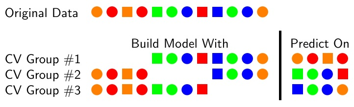

## Overview

1. Criteria for selecting models: Bias-Variance trade-off
2. Method to selecting models: Cross-validation
3. Alternative method: Information criteria

## Model selection by model fit

- **Question:** How to select a model that fits well, but is simple and generalizable?
- **Problem:** Models that fit the sample data the best will over-fit
- **Solution:** Compare methods by their out-of-sample (predictive) fit

## Bias-Variance Tradeoff

- The dependent variable is a function $y = f(x)$ but we don't know $f$
- Want to find the estimate $\hat{f}(x)$ that best approximates true $f(x)$,
    $$
    E(y - \hat{f}(x))^2 = \Bias(\hat{f}(x))^2 + \Var(\hat{f}(x)) +\sigma^2
    $$
- Difference between $y$ and $\hat{y}$:  Bias, Variance, and irreducible error
- In OLS, $f(x) = \mat{X} \hat{\vec{\beta}}$

## Bias-Variance Tradeoff

- Bias: How close $\hat{f}$ is to the true $f$
- Variance: How much estimate of $\hat{f}$ changes in samples
- More flexible (complex) model
    - less bias
    - more variance
- Want to find "Sweet-spot": smallest MSE (low bias, low variance)

## Over- and Under-fitting Trade-off

## Out-of-Sample Fit

1. Fit the model on a *training set*, $\{mat{X}_{train}, \vec{y}_{train}\}$ and estimate $\hat{\vec{\beta}}_{train}$.
2. Calculate fitted $\hat{\vec{y}}_{test}$ for the *test* or *validation* set, $\{\mat{X}_{test}, \vec{y}_{test}\}$ using $\hat{\vec{\beta}}_{train}$
3. Calculate MSE
  $$
  \frac{1}{n_{test}} \sum_{i \in test} y_i - \vec{x}'_i \hat{\vec{\beta}}_{train}
  $$

- **Problem:** The out-of-sample fit highly variable; depends on particular train/test split. Can *overfit* the training dataset.

* * *

## Cross-validation

1. Split data into $K$ equal "folds", labeled $k = 1, \dots, K$.
2. For $k = 1$, Estimate $\hat{\beta}_1$ using data from all folds *other than* $k$.
2. Predict $\hat{\vec{y}}_i$ on the *held-out* fold, $k = 1$, and calculate $MSE_1$
3. Repeat for $k = 2, \dots, K$.
4. $K$-fold cross validation MSE is $\frac{1}{K} \sum MSE_k$.

## Cross-validation Model Selection

- How many folds to use: 5--10.
- LOO-CV: Leave-one-Out Cross Validation. N-folds (each fold is an observation).
- Best model is one will lowest cross validation predictive error
- Balances simplicity and flexibility of the model to avoid over-fitting
- Prediction not only criteria for model selection

## Cross-validation Extensions

- Time series:

  - Set test/training splits so training sets always predict future observations

- Panel: Multiple ways to think about prediction

  - Individual observations
  - Groups: split by group, and predict observations on new groups
  - Time: keep all groups, but predict future observations from past observations in each group.
  - Different models may work better at different prediction tasks

## Information Criteria

- Log likelihood with a penalty
  $$
  - 2 * \text{log Likelihood} + \text{penalty}
  $$
- Log likelihood: sum of probabilities of observing data given parameters
  $$
  \sum_i \log p(y_i | \hat{\vec{beta}})
  $$
- Penalty increases with number of parameters (penalizes flexibility)
- AIC (Akaike Information Criteria)
- BIC (Bayesian Information Criteria)

## References

- http://robjhyndman.com/hyndsight/tscvexample/
- http://robjhyndman.com/hyndsight/crossvalidation/
- Fox, *Applied Regression Analysis*, Ch 22 "Model Selection"
- [Image of CV](http://tex.stackexchange.com/questions/154110/can-i-draw-shapes-and-align-them-as-a-matrix-or-a-table-using-tikz)
- [Understanding the Bias-Variance Tradeoff](http://scott.fortmann-roe.com/docs/BiasVariance.html)
- [R for data science](http://r4ds.had.co.nz/model-assess.html)
