# Homework Assignments

- Each student has its own private repository.
- The name of the repository is the student's UW `netid`.
- All students and instructors can **see** the content of the repos.
- Only the student, the instructor, and the TA can **edit** the content of the repo.

## 1. No need to Fork the repository

For the **project** assignments, you don't need to create your own copy (fork) of the original repository that it's located in the `UW-POLS503` organization.

## 2. Clone the repository

You do need to clone the repo.

a. Copy the URL of your repository from GitHub.

b. Open RStudio and create a new Git RProject: `File > New Project > Version Control > Git`

c. Enter the URL to where it says `Repository URL`. It will create a directory name with your `UW netID`. This new directory will have the original files in the repository plus an `.Rproj` and `.gitingore` file.

    

    
    

## 3. Work on a new Project Assignment

Every time you work on a new assignment:

a. Create a new file (e.g. `proposal.md`).
b. Save it.

## 4. Submitting a new Project Assignment

a. Push and Commit the changes you made to existing files, or the new files you created, to the online version of the repository. Follow the same instructions in [here](http://uw-pols503.github.io/pols_503_sp16/submitting-homework#4_commit_and_push_changes).

b. Create a new issue in your private repository in GitHub.

    

    
    

c. Title the new issue “Review Project Assignment <number>”. In the issue message write “cc @jrnold @CasAndreu”. This is how you submit your assignment, and let the instructors know it is ready to review. You're done!

    

    
    

# Project Assignments

We'll create a new repository in the [UW-POLS503](https://github.com/UW-POLS503) organization for each assignment (e.g. [Assignment_01](https://github.com/UW-POLS503/Assignment_01) ). Follow the following steps to work on and submitt the homework.

## 1. Fork the repository.

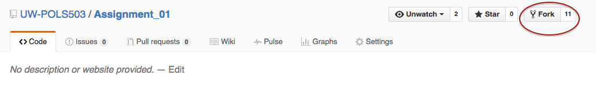

Now you have a copy of the repository in your online`GitHub` account.

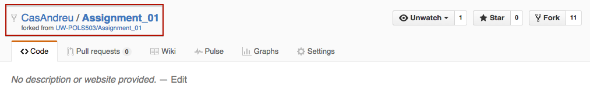

## 2. Clone the repository using RStudio.

a. Copy the URL of your repository from GitHub.

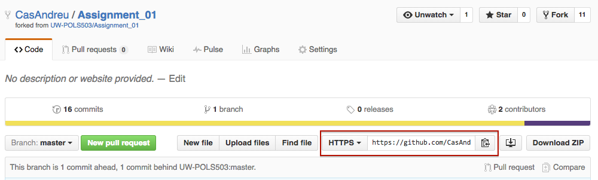

b. Open RStudio and create a new Git RProject: `File > New Project > Version Control > Git`

c. Enter the URL to where it says `Repository URL`. It will create a directory named `Assignment_01` that will have the original files in the repository plus an `.Rproj` and `.gitingore` file.

    

    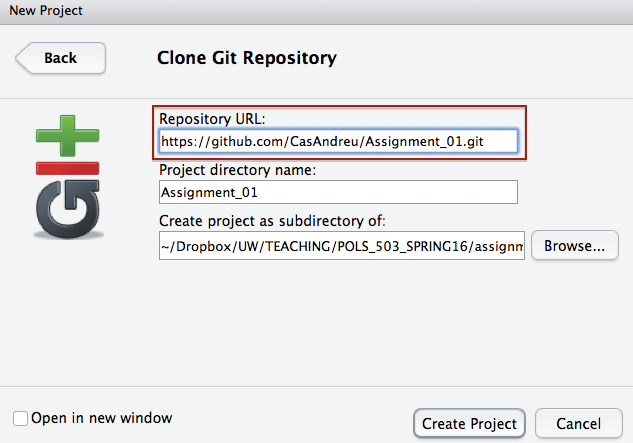
    

## 3. Create an R Markdown file: `solutions.Rmd`.

a. `File > New File > R Markdown`

    

    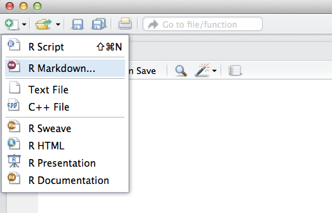
    

b. Give it a `Title`: e.g. ** Assignment 1**.

c. Choose PDF as the `Default Output Format`.

d. Now you have an `R Markdown` document that looks similar to this.

    

    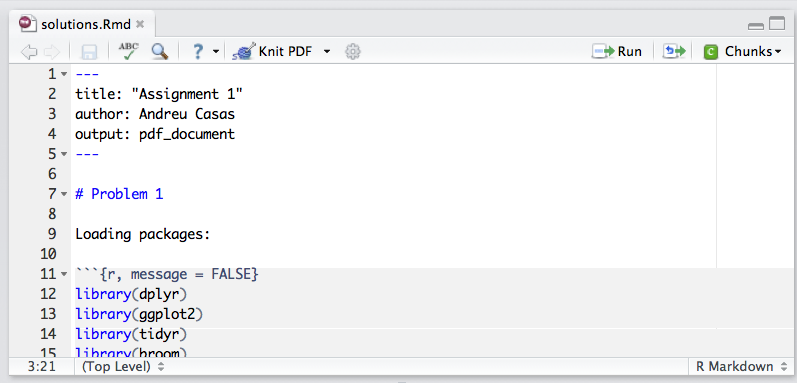
    

e. Write your solutions in this `R Mardown` document.

## 4. Commit and Push changes.

Once you're done writing your solutions:

a. Make sure you saved the final version of `solutions.Rmd`.

b. Staged the changes and click on `Commit`.

    

    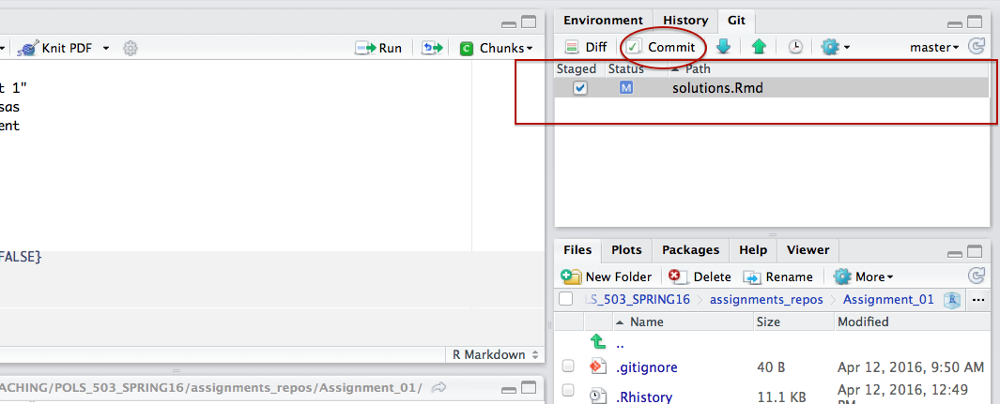
    

c. Write a commit message and click on `Commit` again. A window message should open indicating that the commit has been made. Close it.

    

    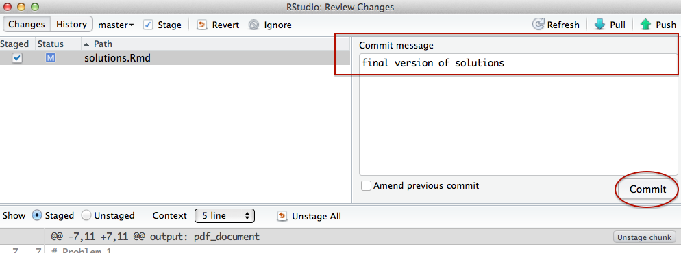
    

d. Finally, click on `Push`.

    

    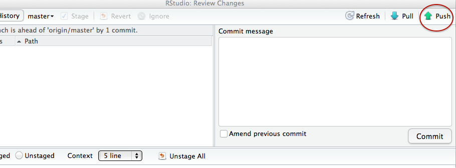
    

Another window message shoud open indicating that you have pushed the changes to the online verison of the repository in your GitHub account.

    

    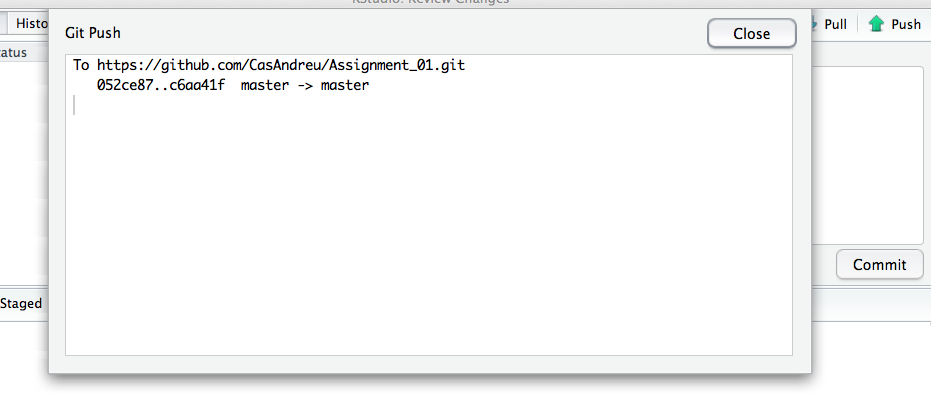
    

## 5. Initiate a Pull Request.

Once you're done with the assignment and your `solutions.Rmd` is already in your online version of the assignment's repository:

a. Click on `New Pull Request`.

    

    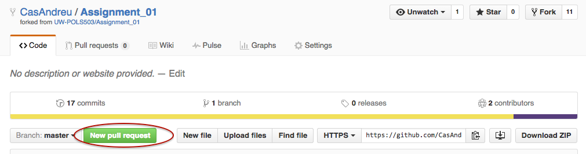
    

b. Click on `Create pull request`.

    

    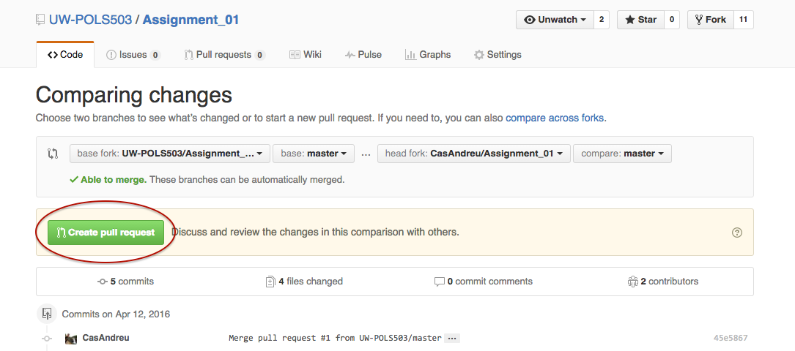
    

c. Title your pull request **Submission** and click on `Create pull request`.

    

    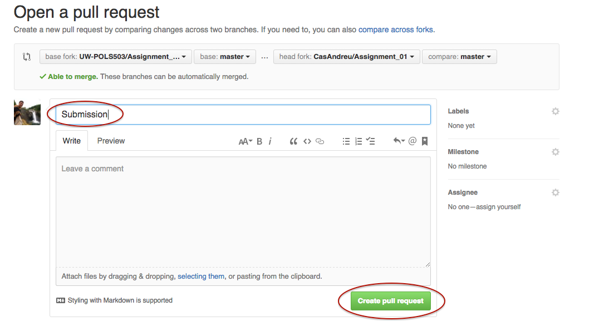
    

