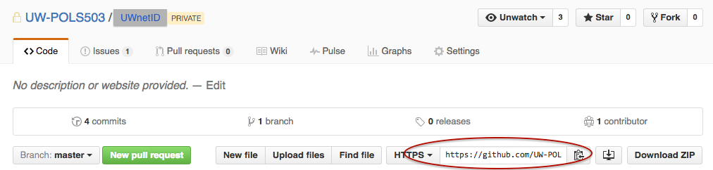
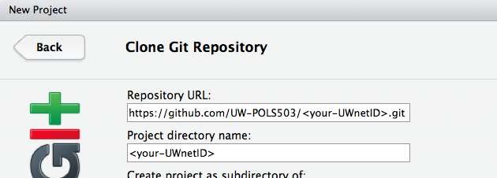

- Each student has its own private repository.
- The name of the repository is the student's UW `netid`.
- All students and instructors can **see** the content of the repos.
- Only the student, the instructor, and the TA can **edit** the content of the repo.

# No need to Fork the repository

For the **project** assignments, you don't need to create your own copy (fork) of the original repository that it's located in the `UW-POLS503` organization. 

# Clone the repository

You do need to clone the repo. 

a. Copy the URL of your repository from GitHub.

b. Open RStudio and create a new Git RProject: `File > New Project > Version Control > Git`

c. Enter the URL to where it says `Repository URL`. It will create a directory name with your `UW netID`. This new directory will have the original files in the repository plus an `.Rproj` and `.gitingore` file.

# Work on a new Project Assignment

Every time you work on a new assignment:

1. Create a new file (e.g. `proposal.md`).
2. Save it.

# Submitting a new Project Assignment

1. Push and Commit the changes you made to existing files, or the new files you created, to the online version of the repository. Follow the same instructions in [here](http://uw-pols503.github.io/pols_503_sp16/submitting-homework#4_commit_and_push_changes).

2. Create a new issue in your private repository in GitHub.

3. Title the new issue “Review Project Assignment <number>”. In the issue message write “cc @jrnold @CasAndreu”. This is how you submit your assignment, and let the instructors know it is ready to review. You're done!

